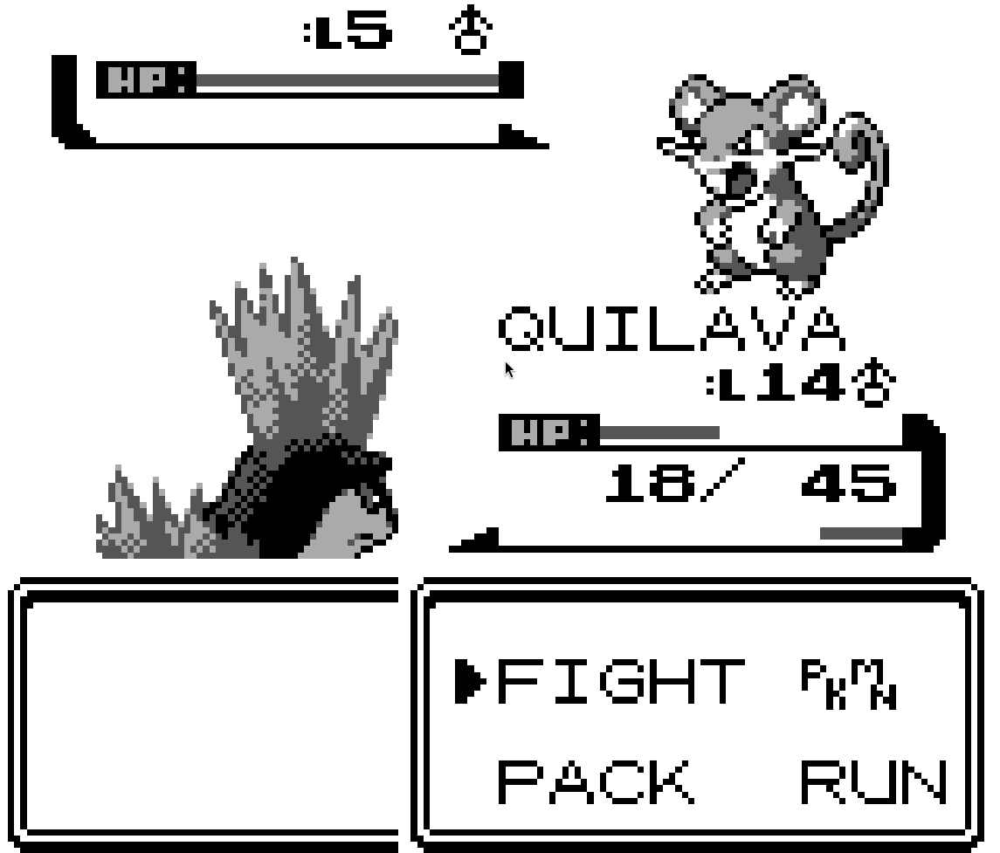

# RustBoy



## Architecture

* **CPU (SM83 Core):** Fully decodes and executes the standard and `0xCB` prefixed instruction sets. Emulates hardware quirks including the HALT bug.
* **PPU (Graphics):** Implements scanline-accurate rendering across Mode 0, 1, 2, and 3. Accurately tracks `LY` to `LYC` and handles edge cases for mid-scanline register mutations.
* **APU (Audio):** 4-channel audio synthesis (Square, Square-sweep, Wave, and Noise) clocked via a 512hz frame sequencer. Uses a lock-free ring buffer to keep threads separate and continuous, avoiding audio artifacts or main thread blocking.
* **Memory & Mappers:** Decodes memory bank controllers. Supports MBC1 (ROM/RAM banking) and MBC3 (banking + RTC), writing battery-backed SRAM to `.sav` files.

## Accuracy & Testing

The emulator has been heavily tested against various conformance ROMs:
* **Blargg `cpu_instrs`**: Passes all sub-tests; unit tests are included in this project for this specific test set.
* **Blargg `dmg-sound-2`**: Passes most tests apart from wave timing-related tests, explained further in known limitations.
* **`dmg-acid2`**: Passes full PPU rendering tests, displays the expected image with no artifacts.

Tested commercial titles include *Tetris, Super Mario Land, Dr. Mario, Metroid II, and Pokémon Red/Silver*. (ROMs for these games are not provided due to copyright).

## Key Technical Challenges

**1. Mid-Scanline Register Timing (dmg-acid2)**
Whilst writing the PPU, multiple tests failed; every time one was fixed, another would pop up. After some debugging, it was revealed that the problem wasn't actually where the tests were aiming, but an LCD write mid-frame via STAT interrupts. The fix included adding further cycle accuracy and checking for interrupts on `LY == LYC`.

**2. APU Sound Implementation (In-Game Testing)**
After writing a few of the channels, specifically both square ones, testing sound in-game resulted in off-pitch audio and multiple popping artifacts. This was initially suspected to be LCDC write problems, however, after multiple iterations, the sound continued to act like this. Eventually, I realized two things: first, I did not need to use a specific `target_fps` function, as my APU could now control timing due to the piping into the main loop; and second, my APU was pushing to my buffer faster than the consumption rate. Therefore, a while loop was needed when feeding the sound stream to check if the ring buffer had 2 vacant spots (1 per channel) before pushing. This completely eradicated sound artifacts and popping.

## Known Limitations

* **Wave RAM Timing:** The CPU executes instructions in batched T-cycles (accumulates cycles then returns after the instruction is completely done) rather than M-cycles. While this improves performance, it exposes edge cases on wave channel timing. While output is perfectly timed, it still won't pass sound-based tests that write and read to the Wave RAM quickly, as the checksum for the answer is incorrect due to this instruction batching. This does not affect commercial games or emulator experience.
* **Boot ROM:** The initial 256-byte DMG boot ROM animation is intentionally bypassed; the emulator initializes with the exact post-boot register states.
* **MBC5:** MBC5 is not implemented, so some late-stage Game Boy / Game Boy Color games won't run.

## Build and Run

To run the emulator, ensure you have Rust installed and provide a valid Game Boy ROM (`.gb`/`.gbc`). Some test ROMs are already included (`./tests/roms/*.gb`):

```bash
cargo run -- <path_to_rom.gb>
```

***
**Controls:**
* **D-pad:** `W`, `A`, `S`, `D`
* **A / B:** `J` / `K`
* **Start / Select:** `Enter` / `Right Shift`
***

To check unit tests, make sure the requirements above are met, then run:

```bash
cargo test
```
